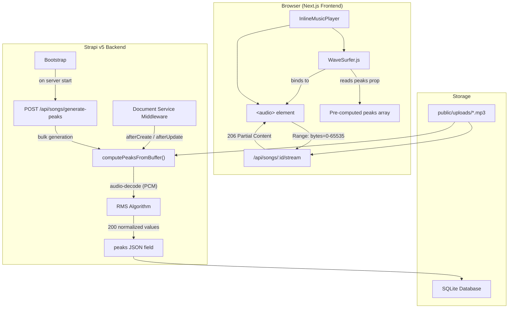
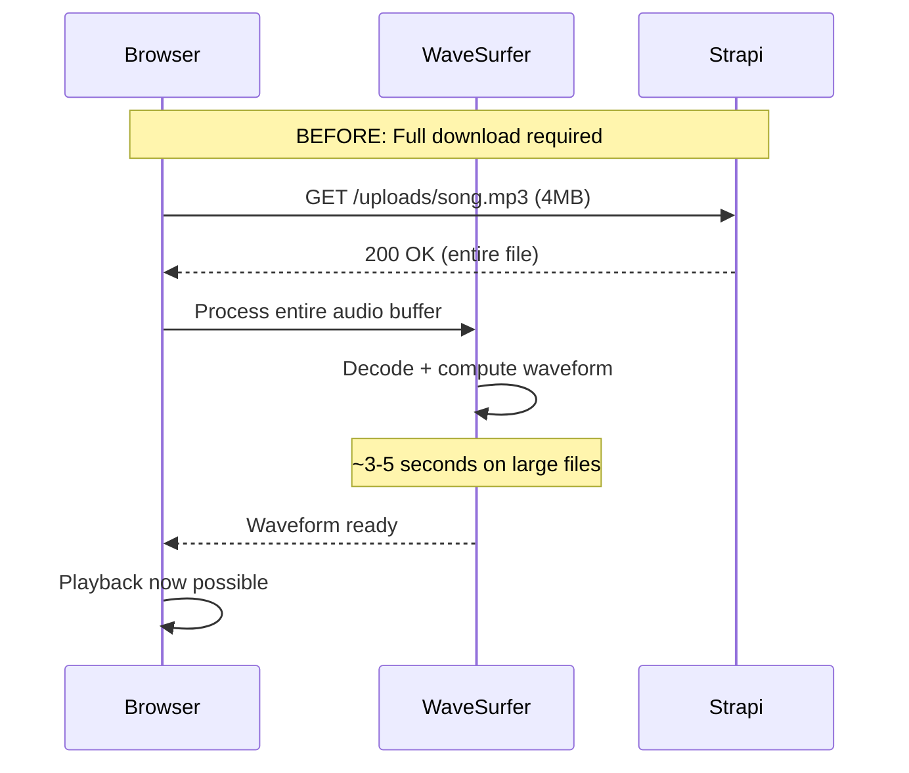
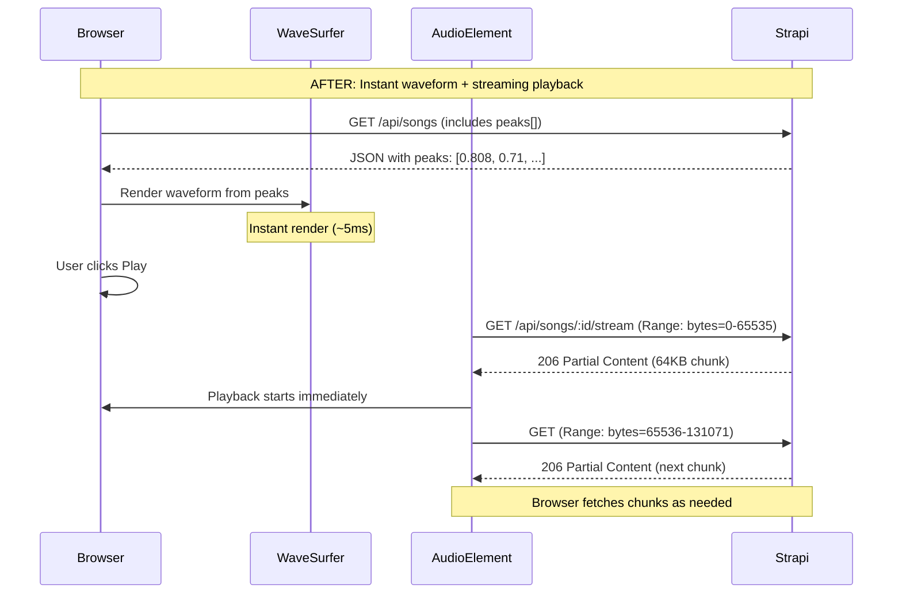
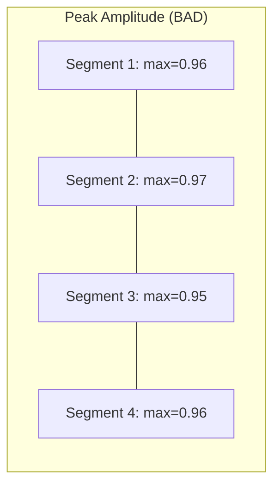
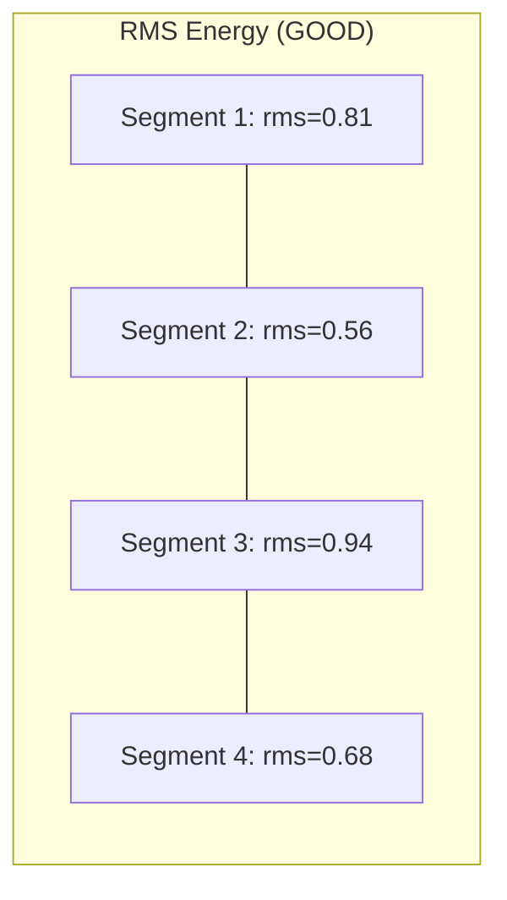
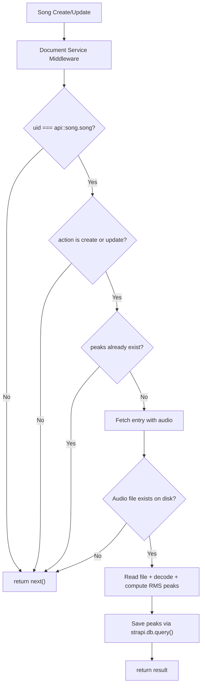
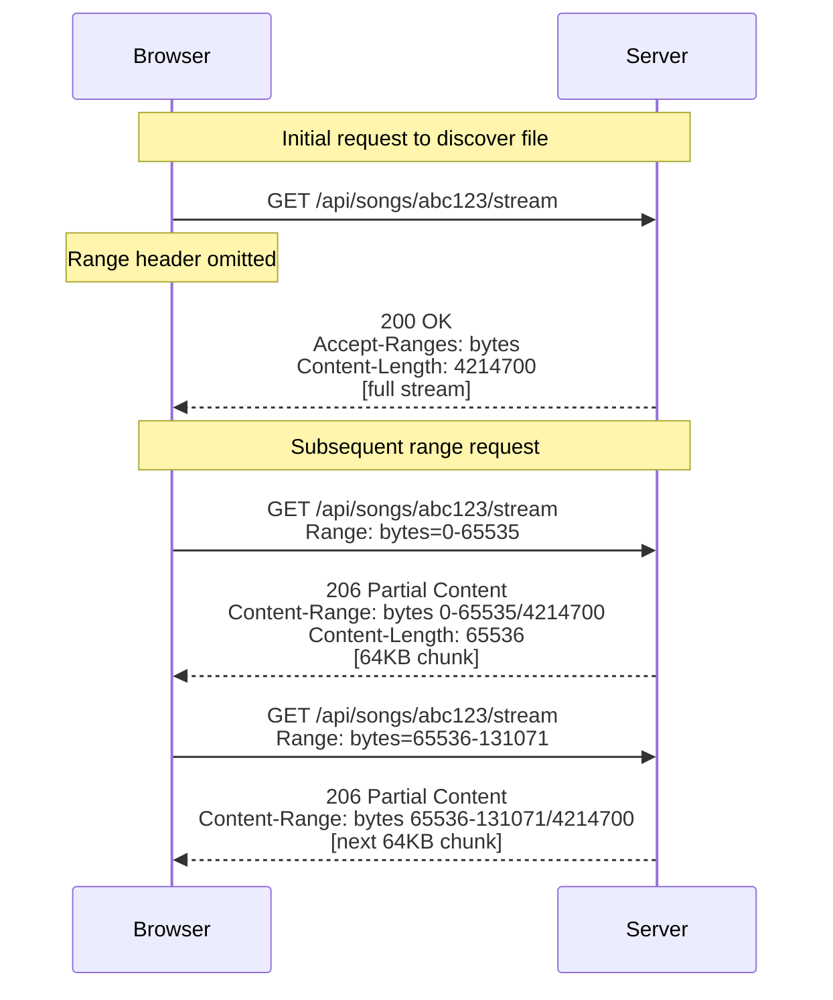
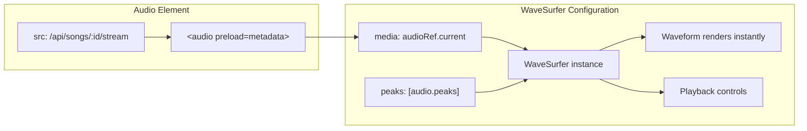

# Audio Streaming & Pre-computed Waveform Peaks

## Table of Contents

- [Overview](#overview)
- [Architecture](#architecture)
- [The Problem](#the-problem)
- [The Solution](#the-solution)
- [Backend Implementation](#backend-implementation)
  - [Schema Changes](#1-schema-changes)
  - [Peak Computation Algorithm](#2-peak-computation-algorithm)
  - [Document Service Middleware](#3-document-service-middleware)
  - [Streaming Endpoint](#4-streaming-endpoint)
  - [Webhook for Bulk Peak Generation](#5-webhook-for-bulk-peak-generation)
  - [Bootstrap Migration](#6-bootstrap-migration)
- [Frontend Implementation](#frontend-implementation)
  - [Type Updates](#7-type-updates)
  - [Rewritten Music Player](#8-rewritten-music-player)
  - [Hydration Safety](#9-hydration-safety)
- [API Reference](#api-reference)
- [File Map](#file-map)
- [Lessons Learned](#lessons-learned)

---

## Overview

This document describes how we implemented audio streaming with HTTP Range requests and pre-computed waveform peaks in a Strapi v5 + Next.js music player application. The goal was to eliminate the need to download entire audio files before playback or waveform rendering.

## Architecture



## The Problem

The original implementation had two major performance issues:



1. **Full file download** -- The browser had to download the entire audio file before WaveSurfer could render the waveform or start playback.
2. **Client-side waveform processing** -- WaveSurfer decoded the full audio and computed waveform data in the browser, causing a loading delay.

## The Solution



---

## Backend Implementation

### 1. Schema Changes

**File:** `backend/src/api/song/content-types/song/schema.json`

Added a `peaks` JSON field to the Song content type to store pre-computed waveform data:

```json
{
  "attributes": {
    "title": { "type": "string" },
    "audio": {
      "allowedTypes": ["audios"],
      "type": "media",
      "multiple": false
    },
    "peaks": {
      "type": "json"
    }
  }
}
```

The `peaks` field stores an array of 200 floating-point numbers between 0 and 1. Strapi's `json` type serializes this to a JSON string in SQLite and returns it as a parsed array in API responses.

---

### 2. Peak Computation Algorithm

**File:** `backend/src/api/song/utils/peaks.ts`

```typescript
const NUM_PEAKS = 200;

export async function computePeaksFromBuffer(buffer: Buffer): Promise<number[]> {
  // audio-decode is ESM-only, so we dynamically import it
  const { default: decode } = await import('audio-decode');

  const audioBuffer = await decode(buffer);
  const channelData = audioBuffer.getChannelData(0); // use first channel
  const samples = channelData.length;

  if (samples === 0) return Array(NUM_PEAKS).fill(0);

  const samplesPerPeak = Math.max(1, Math.floor(samples / NUM_PEAKS));

  // Compute RMS for each segment
  const rmsValues: number[] = [];
  for (let i = 0; i < NUM_PEAKS; i++) {
    let sumOfSquares = 0;
    const start = i * samplesPerPeak;
    const end = Math.min(start + samplesPerPeak, samples);
    const count = end - start;

    for (let j = start; j < end; j++) {
      sumOfSquares += channelData[j] * channelData[j];
    }

    rmsValues.push(Math.sqrt(sumOfSquares / count));
  }

  // Normalize to 0-1 range based on the max RMS value
  const maxRms = Math.max(...rmsValues);
  if (maxRms === 0) return Array(NUM_PEAKS).fill(0);

  return rmsValues.map((v) => Math.round((v / maxRms) * 1000) / 1000);
}
```

#### Why RMS instead of Peak Amplitude?

This was a key lesson. Our first implementation used **peak amplitude** (the maximum absolute sample value in each segment):



On mastered/compressed audio (which most commercial music is), peak amplitude is nearly constant at ~0.95-1.0 across the entire track. This produces a flat waveform with no visual variation -- every bar is the same height.

**RMS (Root Mean Square)** measures the average energy of a segment, which correlates with perceived loudness and varies significantly even in heavily compressed audio:



The RMS formula for a segment of N samples:

```
RMS = sqrt( (1/N) * sum(sample[i]^2) )
```

After computing all 200 RMS values, we normalize them to the 0-1 range by dividing by the maximum RMS value. This ensures the loudest segment is always 1.0, and quieter segments are proportionally smaller.

#### Why `audio-decode`?

We need to decode compressed audio (MP3, AAC, etc.) to raw PCM samples before computing peaks. Reading the raw file bytes as PCM doesn't work because compressed audio formats store encoded data, not raw amplitude values.

The `audio-decode` npm package:
- Pure JavaScript (no native dependencies like ffmpeg)
- Supports MP3, WAV, OGG, FLAC
- Returns a standard `AudioBuffer` with `getChannelData()` for Float32Array PCM samples (-1.0 to 1.0)

---

### 3. Document Service Middleware

**File:** `backend/src/index.ts` (in `register()`)

Strapi v5 replaced lifecycle hooks with **Document Service Middleware**. These are registered in the `register()` phase and intercept all document operations:

```typescript
register({ strapi }: { strapi: Core.Strapi }) {
  strapi.documents.use(async (context, next) => {
    const result = await next();

    // Only act on song create/update
    if (context.uid !== 'api::song.song') return result;
    if (!['create', 'update'].includes(context.action)) return result;

    // Narrow the result type (could be number from count, array, etc.)
    if (!result || typeof result !== 'object' || Array.isArray(result)) return result;
    const doc = result as Record<string, any>;
    if (!doc.documentId) return result;

    // Skip if peaks already exist
    if (doc.peaks && Array.isArray(doc.peaks) && doc.peaks.length > 0) {
      return result;
    }

    // Fetch with audio populated, compute peaks, save via db.query
    const entry = await strapi.documents('api::song.song').findOne({
      documentId: doc.documentId,
      populate: { audio: true },
    });

    if (!entry?.audio?.url) return result;

    const uploadsDir = path.join(strapi.dirs.static.public, 'uploads');
    const fileName = path.basename(entry.audio.url);
    const filePath = path.join(uploadsDir, fileName);

    if (!fs.existsSync(filePath)) return result;

    try {
      const buffer = fs.readFileSync(filePath);
      const peaks = await computePeaksFromBuffer(buffer);

      // Use db.query to avoid re-triggering middleware
      await strapi.db.query('api::song.song').updateMany({
        where: { documentId: doc.documentId },
        data: { peaks },
      });
    } catch (err) {
      strapi.log.error(`[peaks] Failed to generate peaks: ${err}`);
    }

    return result;
  });
},
```



Key design decisions:
- **`strapi.db.query()` instead of `strapi.documents()`** -- Saving peaks via the low-level database query avoids re-triggering the middleware in an infinite loop.
- **Type narrowing** -- The middleware `result` is a union type (`number | object | array`). We narrow it before accessing `.documentId`.
- **Idempotent** -- Skips if peaks already exist, making it safe to run repeatedly.

---

### 4. Streaming Endpoint

**Route:** `backend/src/api/song/routes/custom-song.ts`

```typescript
export default {
  routes: [
    {
      method: 'GET',
      path: '/songs/:id/stream',
      handler: 'custom-song.stream',
      config: { auth: false },
    },
    {
      method: 'POST',
      path: '/songs/generate-peaks',
      handler: 'custom-song.generatePeaks',
      config: { auth: false },
    },
  ],
};
```

**Controller:** `backend/src/api/song/controllers/custom-song.ts`

```typescript
async stream(ctx: any) {
  const { id } = ctx.params; // documentId

  // Look up song and resolve file path
  const entry = await strapi.documents('api::song.song').findOne({
    documentId: id,
    populate: { audio: true },
  });

  if (!entry?.audio?.url) {
    ctx.status = 404;
    ctx.body = { error: 'Song or audio file not found' };
    return;
  }

  const uploadsDir = path.join(strapi.dirs.static.public, 'uploads');
  const fileName = path.basename(entry.audio.url);
  const filePath = path.join(uploadsDir, fileName);
  const stat = fs.statSync(filePath);
  const fileSize = stat.size;
  const contentType = MIME_TYPES[path.extname(fileName).toLowerCase()] || 'application/octet-stream';

  const range = ctx.request.headers.range;

  if (range) {
    // Partial content response
    const parts = range.replace(/bytes=/, '').split('-');
    const start = Number.parseInt(parts[0], 10);
    const end = parts[1] ? Number.parseInt(parts[1], 10) : fileSize - 1;
    const chunkSize = end - start + 1;

    ctx.status = 206;
    ctx.set('Content-Range', `bytes ${start}-${end}/${fileSize}`);
    ctx.set('Accept-Ranges', 'bytes');
    ctx.set('Content-Length', String(chunkSize));
    ctx.set('Content-Type', contentType);
    ctx.body = fs.createReadStream(filePath, { start, end });
  } else {
    // Full file fallback
    ctx.set('Content-Length', String(fileSize));
    ctx.set('Content-Type', contentType);
    ctx.set('Accept-Ranges', 'bytes');
    ctx.body = fs.createReadStream(filePath);
  }
},
```

#### How HTTP Range Requests Work



The browser's `<audio>` element handles range requests automatically. We just need to:

1. Advertise `Accept-Ranges: bytes` in the response headers
2. Parse the `Range` request header
3. Return `206 Partial Content` with the correct `Content-Range` header
4. Use `fs.createReadStream(filePath, { start, end })` for memory-efficient partial reads

---

### 5. Webhook for Bulk Peak Generation

**File:** `backend/src/api/song/utils/generate-missing-peaks.ts`

A shared utility used by both the bootstrap migration and the webhook endpoint:

```typescript
export async function generateMissingPeaks(force = false) {
  const findOptions: any = {
    populate: { audio: true },
    status: 'published',
  };

  if (!force) {
    findOptions.filters = {
      $or: [{ peaks: { $null: true } }, { peaks: { $eq: null } }],
    };
  }

  const songs = await strapi.documents('api::song.song').findMany(findOptions);

  let generated = 0;
  for (const song of songs) {
    if (!song.audio?.url) continue;
    // ... read file, compute peaks, save to DB
    generated++;
  }

  return { processed: songs.length, generated };
}
```

**Usage:**

```bash
# Generate peaks only for songs missing them
curl -X POST http://localhost:1337/api/songs/generate-peaks

# Force regenerate ALL peaks (e.g., after algorithm change)
curl -X POST "http://localhost:1337/api/songs/generate-peaks?force=true"
```

**Response:**

```json
{
  "message": "Peak generation complete",
  "processed": 6,
  "generated": 6
}
```

---

### 6. Bootstrap Migration

**File:** `backend/src/index.ts` (in `bootstrap()`)

On every server start, we check for songs missing peaks and generate them:

```typescript
async bootstrap({ strapi }: { strapi: Core.Strapi }) {
  // Generate peaks for any existing songs that are missing them
  await generateMissingPeaks();

  // ... rest of seeding logic
},
```

This ensures that:
- Existing songs uploaded before this feature was added get peaks
- Songs where peak generation failed previously get retried

---

## Frontend Implementation

### 7. Type Updates

**File:** `frontend/lib/types.ts`

```typescript
export interface StrapiAudioData {
  id: number;
  documentId: string;      // needed for stream URL
  title: string;
  peaks?: number[] | null;  // pre-computed waveform data
  artist: {
    id: number;
    name: string;
  };
  image: {
    id: number;
    url: string;
    alternativeText: string;
  };
  audio: {
    id: number;
    url: string;
  };
}
```

`documentId` and `peaks` are scalar fields on the Song content type, so Strapi v5 includes them automatically in API responses without any query changes.

---

### 8. Rewritten Music Player

**File:** `frontend/components/custom/InlineMusicPlayer.tsx`

The key changes from the original player:

| Aspect | Before | After |
|--------|--------|-------|
| Audio loading | `useWavesurfer({ url: strapiMediaUrl })` | `<audio src={streamUrl}>` with `media` option |
| Waveform data | Computed client-side from full download | `peaks` prop from API |
| WaveSurfer init | `useWavesurfer` hook | Manual `WaveSurfer.create()` in `useEffect` |
| Playback start | After full file downloaded | Instant (browser streams chunks) |

```typescript
// Stream URL uses documentId, not the media file URL
const streamUrl = `${strapiBase}/api/songs/${audio.documentId}/stream`;

// Hidden audio element handles streaming
<audio ref={audioRef} src={streamUrl} preload="metadata" />

// WaveSurfer binds to the audio element and uses pre-computed peaks
const ws = WaveSurfer.create({
  container: containerRef.current,
  media: audioRef.current,                              // bind to <audio>
  peaks: audio.peaks?.length ? [audio.peaks] : undefined, // pre-computed
  height: 50,
  waveColor: "rgb(236 72 153)",
  progressColor: "rgb(164, 162, 161)",
  barGap: 1.5,
  barWidth: 3,
  barHeight: 0.75,
  barRadius: 3,
  dragToSeek: true,
  barAlign: "bottom",
});
```



The `peaks` option accepts `number[][]` (array of arrays, one per channel). We wrap our single-channel peaks in an array: `[audio.peaks]`.

When peaks are provided, WaveSurfer renders the waveform immediately without needing to decode any audio data. The `media` option binds WaveSurfer to the native `<audio>` element, which handles streaming natively.

---

### 9. Hydration Safety

Next.js renders components on the server first (SSR), then "hydrates" them on the client. The `<audio>` element can cause hydration mismatches because the browser may inject additional child elements.

We solve this with a `mounted` state guard:

```typescript
const [mounted, setMounted] = useState(false);

useEffect(() => {
  setMounted(true);
}, []);

// In JSX:
{mounted && streamUrl && (
  <audio ref={audioRef} src={streamUrl} preload="metadata" />
)}
```

During SSR, `mounted` is `false`, so the `<audio>` element is not rendered in the server HTML. On the client, after hydration, `mounted` becomes `true` and the audio element appears. This guarantees the server and client HTML match exactly.

The WaveSurfer initialization also depends on `mounted`:

```typescript
useEffect(() => {
  if (!mounted || !containerRef.current || !audioRef.current || !streamUrl) return;
  // ... create WaveSurfer
}, [mounted, streamUrl, audio.peaks]);
```

---

## API Reference

### GET `/api/songs/:documentId/stream`

Streams the audio file for a song. Supports HTTP Range requests for partial content delivery.

| Parameter | Type | Description |
|-----------|------|-------------|
| `documentId` | path | The Strapi document ID of the song |

**Headers:**

| Header | Example | Description |
|--------|---------|-------------|
| `Range` | `bytes=0-65535` | Optional. Requests a specific byte range. |

**Responses:**

| Status | Description |
|--------|-------------|
| `200` | Full file (no Range header sent) |
| `206` | Partial content (Range header present) |
| `404` | Song not found or audio file missing |

**Response Headers (206):**

```
Content-Range: bytes 0-65535/4214700
Accept-Ranges: bytes
Content-Length: 65536
Content-Type: audio/mpeg
```

---

### POST `/api/songs/generate-peaks`

Triggers peak generation for songs. Used as a webhook or manual trigger.

| Parameter | Type | Description |
|-----------|------|-------------|
| `force` | query | `true` to regenerate all peaks, not just missing ones |

**Example:**

```bash
# Only missing peaks
curl -X POST http://localhost:1337/api/songs/generate-peaks

# Force regenerate all
curl -X POST "http://localhost:1337/api/songs/generate-peaks?force=true"
```

**Response:**

```json
{
  "message": "Peak generation complete",
  "processed": 6,
  "generated": 6
}
```

---

## File Map

```
backend/
  src/
    index.ts                                    # register() middleware + bootstrap migration
    api/song/
      content-types/song/
        schema.json                             # Added "peaks" JSON field
      controllers/
        song.ts                                 # Default Strapi CRUD (unchanged)
        custom-song.ts                          # stream() + generatePeaks() handlers
      routes/
        song.ts                                 # Default Strapi routes (unchanged)
        custom-song.ts                          # /stream and /generate-peaks routes
      utils/
        peaks.ts                                # computePeaksFromBuffer() - RMS algorithm
        generate-missing-peaks.ts               # Bulk peak generation utility

frontend/
  lib/
    types.ts                                    # Added documentId + peaks to StrapiAudioData
  components/custom/
    InlineMusicPlayer.tsx                       # Rewritten: streaming + pre-computed peaks
```

---

## Lessons Learned

### 1. Peak Amplitude vs RMS for Mastered Audio

Our first attempt used peak amplitude, which produced flat waveforms (all values ~0.95-1.0) on professionally mastered music. Mastered tracks are heavily compressed (in the dynamic range sense), so peak values are nearly constant. **RMS energy** varies much more and produces waveforms that look like what you see in SoundCloud or Spotify.

### 2. Strapi v5 Lifecycle Hooks are Deprecated

Strapi v5 replaced content-type lifecycle hooks (`beforeCreate`, `afterUpdate`, etc.) with **Document Service Middleware**. The middleware pattern is:

```typescript
// In register()
strapi.documents.use(async (context, next) => {
  const result = await next();
  // context.uid, context.action, context.params
  return result; // MUST return result
});
```

Key differences from lifecycle hooks:
- Registered globally in `register()`, not per content-type
- You filter by `context.uid` and `context.action` yourself
- You must always `return next()` or the app breaks
- The `result` type is a union -- needs narrowing before property access

### 3. `audio-decode` for Server-Side Audio Processing

You cannot read raw compressed audio bytes as PCM samples. An MP3 file contains encoded frame data, not amplitude values. The `audio-decode` package decodes MP3/WAV/OGG/FLAC to standard `AudioBuffer` objects with Float32Array PCM data, without requiring native dependencies like ffmpeg.

### 4. Use `strapi.db.query()` to Avoid Middleware Loops

When updating data inside a document service middleware, use `strapi.db.query()` instead of `strapi.documents()`. The documents API triggers middleware, which would cause an infinite loop. The low-level `db.query()` bypasses middleware entirely.

### 5. SSR Hydration and `<audio>` Elements

The browser may modify `<audio>` elements during parsing (adding internal child nodes), causing a mismatch with server-rendered HTML. The fix is to only render `<audio>` after the component mounts on the client using a `mounted` state flag.

### 6. `preload="metadata"` for Lazy Loading

Setting `preload="metadata"` on the `<audio>` element tells the browser to only fetch the file's metadata (duration, codec info) initially -- not the actual audio data. The audio content is only fetched when playback starts, keeping initial page load lightweight.
